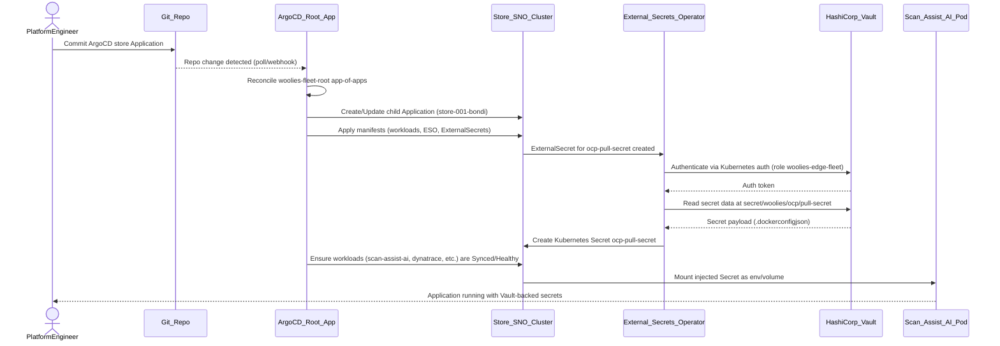

# Woolworths Edge Fleet — Zero Touch Provisioning (ZTP) 🚀
<p align="center">
  
  
  
  
  
  
  
  
</p>

> **Enterprise-grade Edge Platform** for deploying and managing RHEL 9 + OpenShift Single Node (SNO) across 1,000+ Woolworths retail stores, with full GitOps, security, and observability.

This repo is a **reference implementation** of the full **Day 0 → Day 4** lifecycle:

- 🧱 Day 0: Golden Image (Packer + RHEL Image Builder TOML)
- 🤖 Day 0.5: Zero-Touch Install (Kickstart)
- 🔐 Day 1: Fleet Hardening & Networking (Ansible)
- ☸️ Day 1.5: OpenShift SNO Clusters (Agent-Based Installer)
- 🧩 Day 2: Business Workloads (AI, Windows via KubeVirt, MQTT/DDS)
- 🔁 Day 3+: GitOps, Secrets, MCP Agents, and Observability at scale

---

## Architecture Overview 🗺️

```text
                 +-------------------------------+
                 |       Central Hub (OCP)       |
                 |  ACM · ArgoCD · Vault · MCP   |
                 +---------------+---------------+
                                 ^
                                 | GitOps (pull) + Metrics/Logs
                                 |
+---------------------+          |        +----------------------+
|   Store Edge Node   |----------+--------|   Observability Hub  |
|  RHEL 9 + SNO/MicroShift      |        | Thanos · Loki · Graf |
|                             MQTT/DDS   +----------------------+
|  - Scan-Assist AI             |
|  - Checkout Windows (KubeVirt)|
|  - IoT MQTT Broker            |
|  - DDS Gateway                |
+---------------------+         |
        ^                       |
        | ZTP (PXE/ISO)         |
        |                       v
+---------------------+   +----------------------+
|  Golden Image       |   |  GitHub / CI         |
|  Packer + image.toml|   |  Packer · Lint · QA  |
+---------------------+   +----------------------+
```

**Key ideas:**

- **Stores** run a hardened **RHEL 9 Edge** image with **SNO** and local IoT messaging (MQTT + DDS).
- A **central OCP hub** runs ACM, ArgoCD, Vault, and **MCP agents** that orchestrate rollouts, rollbacks, and CVE patching.
- Everything is driven from **Git (this repo)**: Day 0–2 manifests, migration phases, and governance.

---

## Phased Migration: Windows/VMware → RHEL + OpenShift 🧬

We migrate from **Windows on VMware (Dell DTCP)** to **RHEL + OpenShift SNO** using KubeVirt as a bridge:

| Phase | Name           | Duration   | Description                                                                 |
|-------|----------------|-----------|-----------------------------------------------------------------------------|
| **P0** | Foundation     | Weeks 1–2 | Build and scan Golden Image, validate on pilot hardware (CIS, OpenSCAP).   |
| **P1** | Pilot ZTP      | Weeks 3–4 | 5 pilot stores, SNO deployed; Windows VMs imported to KubeVirt (co-exist). |
| **P2** | Fleet Bootstrap| Weeks 5–8 | ~100 stores via Ansible; Windows workloads running via KubeVirt on SNO.    |
| **P3** | Full GitOps    | Weeks 9–12| ~1,000 stores under ArgoCD; Vault secrets and full observability.          |
| **P4** | Decommission   | Weeks 13–16| VMware/Windows retired, KubeVirt removed, all apps containerised.         |

The current phase per image/store is tracked in `image.toml` and Ansible inventory, so **MCP agents and ArgoCD** can gate rollouts safely.

---

## Technology Stack ⚙️

| Layer            | Technology / Pattern                                                                 |
|------------------|--------------------------------------------------------------------------------------|
| OS               | RHEL 9 (Edge / Image Mode, SELinux enforcing, CIS L2)                               |
| Image Build      | Packer + `image.toml` (RHEL Image Builder, provenance + migration metadata)         |
| Provisioning     | Kickstart (Zero-Touch / unattended Dell DTCP install)                               |
| Configuration    | Ansible (CIS hardening, networking, k8s-prep, telemetry bootstrap)                  |
| Container Platform| OpenShift SNO (Agent-Based Installer)                                               |
| GitOps           | ArgoCD (App-of-Apps, AppProject RBAC)                                               |
| Secrets          | HashiCorp Vault + External Secrets Operator (no secrets in Git)                     |
| Legacy VMs       | KubeVirt (Windows checkout-app bridge during P1–P3)                                 |
| Messaging        | MQTT broker (store-level IoT) + DDS Gateway (RTI DDS domain bridge)                 |
| Observability    | Dynatrace + Splunk (or OCP Prometheus/Thanos/Loki)                                  |
| Control Plane AI | MCP Agents (rollout controller, auto-heal, CVE wave gating)                         |
| Hardware         | Dell DTCP (PowerEdge / Precision Edge), Cisco SD-WAN                                |

---

## Repository Structure 📁

```text
woolies-edge-fleet-ztp/
├── 00-provisioning/          # Day 0 — Golden Image (Packer + TOML + Kickstart)
│   ├── packer/               # Packer templates, CIS hardening scripts
│   ├── image-metadata/       # RHEL Image Builder TOML (image.toml)
│   └── kickstart/            # ZTP answer files (store-default.ks)
├── 01-bootstrap/             # Day 1 — Ansible Fleet Bootstrap
│   ├── inventory/            # 1,000 store COP, phases, groups
│   ├── roles/                # hardening, k8s-prep, networking, telemetry
│   └── site-bootstrap.yml    # Master playbook (Saab-style baseline)
├── 02-infrastructure/        # Day 1.5 — OpenShift SNO Manifests
│   ├── manifests/            # install-config + AgentConfig (base + overlays)
│   └── ignition/             # MachineConfig tuning for edge nodes
├── 03-workloads/             # Day 2 — Business Apps + Messaging + MCP
│   ├── scan-assist-ai/       # AI microservice (CPU/GPU overlays)
│   ├── legacy-windows/       # Windows checkout via KubeVirt
│   ├── monitoring/           # Dynatrace / Splunk / OCP operators
│   ├── iot-mqtt/             # MQTT broker for in-store devices
│   ├── dds-gateway/          # DDS ↔ MQTT bridge for deterministic pub/sub
│   └── mcp-agents/           # MCP rollout controller (hub-side control-plane)
└── 04-secrets-cicd/          # Day 3+ — Governance, GitOps, Secrets
    ├── argo-cd/              # App-of-Apps, AppProject, per-store Apps
    ├── external-secrets/     # ESO + Vault SecretStore + ExternalSecret
    └── vault/                # Vault policies (least privilege)
```

---

### Sequence diagram for GitOps sync and Vault-backed secret injection


---

### Migration Phases (Mermaid State Diagram)

```javascript
stateDiagram-v2
  [*] --> P0

  state P0 {
    [*] --> Foundation
    Foundation: Golden_Image_built_and_validated
    Foundation --> [*]
  }

  state P1 {
    [*] --> Pilot_ZTP
    Pilot_ZTP: 5_pilot_stores
    Pilot_ZTP --> [*]
  }

  state P2 {
    [*] --> Fleet_Bootstrap
    Fleet_Bootstrap: 100_stores_bootstrapped
    Fleet_Bootstrap --> [*]
  }

  state P3 {
    [*] --> Full_GitOps
    Full_GitOps: 1000_stores_under_ArgoCD
    Full_GitOps --> [*]
  }

  state P4 {
    [*] --> Decommission
    Decommission: VMware_Windows_retired
    Decommission --> [*]
  }

  note right of Pilot_ZTP
    Kickstart_ZTP
    SNO_installed
    Windows-co-existence
  end note

  note right of Fleet_Bootstrap
    Windows_VMs_on_KubeVirt
  end note

  note right of Full_GitOps
    Vault_secrets
    full_observability
  end note

  note right of Decommission
    KubeVirt_bridge_removed
  end note

  P0 --> P1: migration.current=P1
  P1 --> P2: migration.current=P2
  P2 --> P3: migration.current=P3
  P3 --> P4: migration.current=P4

  P1 --> P0: Rollback
  P2 --> P1: Rollback
  P3 --> P2: Rollback
  P4 --> P3: Rollback
```
## Day 0 → Day 4 Flow (Principal View) 🧠

### Day 0 – Golden Image (Packer + TOML)

- `image.toml` defines:
  - OS identity, packages, services, firewall, kernel args.  
  - Migration metadata: current phase (P0–P4), source/target platform, KubeVirt bridge flag.
- Packer (`rhel9-edge.pkr.hcl`) builds:
  - QCOW2 / ISO images with CIS hardening applied at build time.
  - Provenance stamped into `/etc/os-release` and `/etc/woolies/image.toml`.

**Outcome:** Every store boots a **known-good, audited, immutable** RHEL image.

### Day 0.5 – Zero Touch Install (Kickstart)

- `store-default.ks` drives:
  - Disk layout (CIS-partitioning), SELinux enforcing, minimal packages.  
  - Ansible service account + initial SSH key.  
  - Post-install hook writes `/etc/woolies/node-metadata.json` (image version, phase, platform).

**Outcome:** A store tech can **boot and walk away**; no manual install steps.

### Day 1 – Fleet Bootstrap (Ansible)

- `site-bootstrap.yml` runs end-to-end:
  - `hardening` role: SELinux, SSH, firewall, auditd, AIDE.  
  - `k8s-prep` role: kernel modules, sysctl, swap off, pulls `openshift-install`.  
  - `telemetry` role: Dynatrace/Splunk agent enablement.
- Targeting:
  - `inventory/hosts.ini` groups by **state**, **phase**, and **capabilities** (GPU/KubeVirt).

**Outcome:** All nodes converge on a consistent **security and networking baseline**, ready for OpenShift.

### Day 1.5 – OpenShift SNO (Agent-Based Installer)

- `02-infrastructure/manifests/base/`:
  - Global `install-config.yaml` + `AgentConfig` (SNO pattern).
- `overlays/store-001/`:
  - Store-specific IP, hostname, MAC, machineNetwork.

**Outcome:** Each store’s **cluster definition is declarative**, reproducible, and committed to Git.

### Day 2 – Workloads (AI, Windows, MQTT, DDS, MCP)

- `scan-assist-ai`: AI microservice with CPU/GPU overlays.
- `legacy-windows/checkout-app.yaml`: KubeVirt VM that keeps Windows checkout running inside SNO during migration.
- `iot-mqtt`: Store-local MQTT broker for devices (scales, sensors, cameras).
- `dds-gateway`: Bridges DDS domains to MQTT/Kafka for low-latency control flows.
- `mcp-agents/rollout-controller`:
  - Hub-side controller (conceptually) that:
    - Reads metrics (Thanos), Git state (this repo), and migration phases.  
    - Proposes **wave rollouts** via Git PRs.  
    - Requests rollbacks when SLOs are breached.

**Outcome:** Business functionality moves onto the new platform with **coexistence** (Windows via KubeVirt) and **safe, observed rollouts**.

### Day 3+ – GitOps, Secrets, Governance

- ArgoCD:
  - `app-of-apps.yaml` = single entry point for the whole fleet.  
  - `project-woolies-edge-fleet.yaml` = AppProject with RBAC (platform-admin, store-ops, security).
- Vault + ESO:
  - `vault-secretstore.yaml` + `ExternalSecret` objects fetch all secrets from Vault.  
  - `vault-policy-woolies.hcl` enforces least privilege per store and per team.

**Outcome:** All changes go through **Git PRs**, ArgoCD converges the clusters, Vault supplies secrets, and MCP agents help orchestrate at scale.

---

## Quick Start (Demo Mode) 🏁

> These commands are for demo / lab use; adapt to your CI/CD and infra.

```bash
# 1. Build the Golden Image
cd 00-provisioning/packer
packer init .
packer build -var-file=vars/store-prod.pkrvars.hcl rhel9-edge.pkr.hcl

# 2. Bootstrap a new store node
cd 01-bootstrap
ansible-playbook site-bootstrap.yml -i inventory/hosts.ini --limit store_001

# 3. Deploy OpenShift SNO for that store
cd 02-infrastructure/manifests/overlays/store-001
kustomize build . | oc apply -f -

# 4. Bring workloads under GitOps control
cd 04-secrets-cicd/argo-cd
kubectl apply -f project-woolies-edge-fleet.yaml   # once per hub
kubectl apply -f app-of-apps.yaml
```

---

## Security & Compliance 🔒

- ✅ CIS RHEL 9 Level 2 enforced via Packer + Ansible.
- ✅ SELinux `Enforcing` on all nodes; workloads expected to run with restricted SCC.
- ✅ Secrets never stored in Git – fetched from Vault via External Secrets Operator.
- ✅ Store networks segmented (bonded NICs, VLANs, SD-WAN), with minimal exposed services.
- ✅ Image provenance tracked (TOML manifest + Packer manifest + CI logs).

---

## Contributing 🤝

See `CONTRIBUTING.md` for branching and PR guidelines.  
High‑level:

- Use **Conventional Commits** (e.g. `feat:`, `fix:`, `docs:`).  
- Run `pre-commit` locally (YAML + Ansible lint) before pushing.  
- All changes to `04-secrets-cicd/` require security review.

1. Create a feature branch from `main`.
2. Ensure `pre-commit` passes locally.
3. Raise a PR with:
   - Link to Jira ticket (e.g. EDGEPLT-123)
   - Impacted layers (Day 0, Day 1, etc.)
1. At least one approval from platform team is required.

### All files require platform team review
*           @woolies/platform-team

### Security sensitive
04-secrets-cicd/*   @woolies/security-team

### Migration runbooks
migration/*         @woolies/platform-team @woolies/store-ops

---
## Security Policy

- Secrets must never be committed to Git.
- All credentials are stored in HashiCorp Vault and consumed via External Secrets Operator.
- Changes to `04-secrets-cicd/*` require security team review.
- SELinux is enforced on all nodes; workloads are expected to run under restricted SCC.
- ---
*Maintained by the Edge Platform Engineering team (reference design). In a real Woolies deployment, this would be adapted to existing tooling, networks, and governance.*  