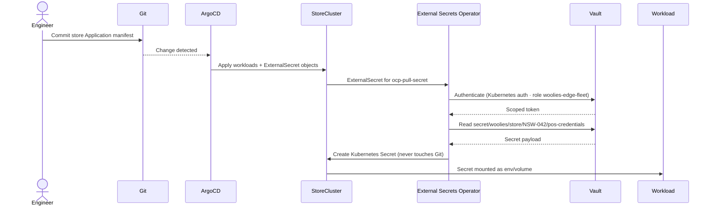

# Woolworths Edge Fleet — Zero-Touch Provisioning (ZTP)
 
<p align="center">


</p>

<p align="center">
  <a href="https://github.com/niksodavaram/woolies-edge-fleet-ztp-demo/actions/workflows/04-infra-tests.yml">
    
  </a>
</p>

<p align="center">
<strong>Reference implementation of a Day 0 → Day 4 edge platform lifecycle</strong>

Migrating 3,000+ Woolworths AU+NZ stores from Windows/VMware to RHEL 9 + MicroShift/SNO

Zero human touch from hardware power-on to first transaction — ~25 minutes per store
</p>
 
<p align="center">
  <strong>Reference implementation of a Day 0 → Day 4 edge platform lifecycle</strong><br/>
  Migrating 3,000+ Woolworths AU+NZ stores from Windows/VMware to RHEL 9 + MicroShift/SNO<br/>
  Zero human touch from hardware power-on to first transaction — ~25 minutes per store
</p>
 
---
 
> **Disclaimer:** This is a personal reference design created by Nireekshan Sodavaram for interview and demonstration purposes. It is not internal Woolworths/WooliesX documentation. All technology references are based solely on publicly available information. In a real deployment this would be adapted to Woolworths' existing tooling, networks, and governance.
 
---
 
## Why This Exists
 
Woolworths runs 3,000+ stores across AU and NZ on a legacy Windows/VMware edge estate. Every store has a local server running POS, inventory, self-checkout, cold chain monitoring and loyalty — all on fragile Windows VMs that require on-site engineers for updates, have no fleet visibility, and fail silently when WAN drops.
 
This repo is a reference implementation of the platform that replaces it: **immutable RHEL 9 + MicroShift/SNO at every store**, managed as a fleet by ACM + ArgoCD from a central hub, observable via Thanos + Loki + Grafana, and self-healing via MCP AI agents. A new store goes live in 25 minutes. A bad update rolls back automatically in under 5 minutes. All 3,000 stores are visible on one Grafana dashboard.
 
---
 
## Architecture
 
```
                     ┌─────────────────────────────────────────┐
                     │         Central Hub — Bella Vista DC     │
                     │  Full OCP · ACM · ArgoCD · Vault · MCP  │
                     │  Thanos Query · Loki · Grafana fleet     │
                     │  RHEL Image Builder · Internal registry  │
                     └──────────────────┬──────────────────────┘
                                        │ GitOps pull + klusterlet
                                        │ Thanos remote_write
                                        │ Loki log ship
                     ┌──────────────────▼──────────────────────┐
                     │    Regional Hub — one per state (SNO)    │
                     │  Thanos Receive relay · Loki aggregator  │
                     │  ACM spoke · SD-WAN POP · ~500 stores    │
                     └──────────────────┬──────────────────────┘
                              Cisco SD-WAN (MPLS + broadband + 4G/5G failover)
                     ┌──────────────────▼──────────────────────┐
                     │         Store Edge Node                  │
                     │  RHEL 9 for Edge (ostree · image mode)  │
                     │  MicroShift (Metro/liquor) │ SNO (large) │
                     │                                          │
                     │  ┌─────────────────────────────────┐    │
                     │  │  RTI DDS local pub-sub bus       │    │
                     │  │  POS ↔ Inventory ↔ Loyalty      │    │
                     │  │  Bayesian outlier filter         │    │
                     │  └──────────────┬──────────────────┘    │
                     │                 │                        │
                     │  MQTT broker ◄──┘    Kafka local buffer  │
                     │  (cold chain IoT)    (POS → BigQuery)    │
                     │                                          │
                     │  Prometheus · Promtail · Alertmanager    │
                     │  ACM klusterlet · greenboot · ostree     │
                     │  KubeVirt (Windows bridge P1–P3 only)    │
                     └──────────────────────────────────────────┘
                              registry.woolies.internal:5000
                              (internal mirror — disconnected-safe)
```
 
**Key design principles:**
 
- **Offline-first** — every store operates fully when SD-WAN drops. Kafka queues, MQTT alerts locally, ostree keeps the OS healthy. ACM reconciles drift on reconnect.
- **Immutable OS** — RHEL image mode (ostree). Every store boots the same signed image. greenboot rolls back automatically in under 5 minutes if unhealthy.
- **Zero secrets in Git** — all credentials fetched from Vault via External Secrets Operator at runtime.
- **Fleet as product** — platform team owns golden images and GitOps pipelines. Store teams never SSH into a node.
- **Internal mirror registry** — `registry.woolies.internal:5000` with `oc adm release mirror`. Stores run fully disconnected — no direct internet required.
 
---
 
## Store Topology — MicroShift vs SNO
 
| Store type | Platform | RAM | Count | Notes |
|---|---|---|---|---|
| Large supermarket | **OpenShift SNO** | 16 GB | ~800 | KubeVirt Windows bridge during P1–P3 |
| Metro / convenience | **MicroShift** | 8 GB | ~1,400 | Lightweight, same ACM klusterlet |
| Liquor / specialist | **MicroShift** | 4 GB | ~800 | Minimal footprint |
 
**Rule:** if a store needs the KubeVirt Windows bridge during migration → SNO (OpenShift Virtualization required). All other stores → MicroShift (same RHEL base, same ACM/ArgoCD GitOps, same observability pipeline, lighter resource footprint).
 
See [ADR-001 — SNO vs MicroShift decision](docs/adrs/ADR-001-sno-vs-microshift.md).
 
---
 
## Phased Migration — Windows/VMware → RHEL + MicroShift/SNO
 
Migration follows a **parallel-run strategy**: Windows VM stays running at each store until the new platform is proven green for 48 hours. No store goes offline. No customer impact.
 
| Phase | Name | Duration | What happens | Stores |
|---|---|---|---|---|
| **P0** | Foundation | Wks 1–2 | Build + CIS-scan golden image. Validate on pilot hardware (OpenSCAP). ACM hub + GitHub repo live. | 0 |
| **P1** | Pilot ZTP | Wks 3–4 | 5 pilot stores. SNO deployed. Windows VMs imported to KubeVirt — store trades on Windows while RHEL/SNO runs in parallel. All data flows validated. | 5 |
| **P2** | Fleet bootstrap | Wks 5–8 | ~100 stores via Ansible. Windows workloads running via KubeVirt on SNO. All data flows green: POS→Kafka→BigQuery, inventory→SAP, cold chain→Vertex AI, Everyday Rewards. | ~100 |
| **P3** | Canary rollout | Mths 3–6 | **50 stores/week** via ArgoCD canary waves. Health gates auto-pause on error spike. Windows removed per store after 48 hr clean run. ACM compliance dashboard live. | ~3,000 |
| **P4** | Full fleet live | Mths 7–18 | All 3,000+ stores AU+NZ on RHEL + MicroShift/SNO. Windows VMs decommissioned. KubeVirt bridge removed. ZTP default for all new store openings. | 3,000+ |
 
Migration phase per store is tracked in `image.toml` — MCP agents and ArgoCD wave gates read this field to control rollout velocity.
 
### Migration state machine
 
```
stateDiagram-v2
  [*] --> P0
 
  state P0 { Foundation: Golden image built, CIS validated, ACM hub live }
  state P1 { Pilot: 5 stores · KubeVirt Windows bridge · parallel run }
  state P2 { Bootstrap: ~100 stores · Windows on KubeVirt · flows validated }
  state P3 { Canary: 50 stores/week · ArgoCD waves · health gates }
  state P4 { Fleet: 3000+ stores · Windows decommissioned · ZTP default }
 
  P0 --> P1 : image.toml migration.current_phase=P1
  P1 --> P2 : image.toml migration.current_phase=P2
  P2 --> P3 : image.toml migration.current_phase=P3
  P3 --> P4 : image.toml migration.current_phase=P4
 
  P1 --> P0 : Rollback
  P2 --> P1 : Rollback
  P3 --> P2 : Rollback
  P4 --> P3 : Rollback
```
 
---
 
## Technology Stack
 
| Layer               | Technology                                                                              | Status   |
| ---------------------| -----------------------------------------------------------------------------------------| ----------|
| OS                  | RHEL 9 for Edge — image mode, ostree, SELinux enforcing, CIS L2                         | Proposed |
| Image build         | **RHEL Image Builder** (`image.toml` blueprint) — Packer optional CI wrapper            | Proposed |
| OS safety net       | **greenboot** health checks + **ostree** auto-rollback — under 5 min                    | Proposed |
| Provisioning        | Kickstart — zero-touch, unattended, writes `/etc/woolies/node-metadata.json`            | Proposed |
| Configuration       | Ansible — CIS hardening, networking, k8s-prep, telemetry bootstrap                      | Proposed |
| Container platform  | **MicroShift** (Metro/liquor) + **OpenShift SNO** (large stores)                        | Proposed |
| Fleet management    | Red Hat ACM — hub+spoke, GitOps-native policy engine, klusterlet                        | Proposed |
| GitOps              | ArgoCD — App-of-Apps, AppProject RBAC, ApplicationSet per store tier                    | Proposed |
| Secrets             | HashiCorp Vault + External Secrets Operator — zero secrets in Git                       | Proposed |
| Windows bridge      | **KubeVirt** — runs Windows checkout VM inside SNO during P1–P3                         | Proposed |
| Low-latency bus     | **RTI DDS** gateway — intra-store pub-sub, Bayesian outlier filter                      | Proposed |
| IoT messaging       | **MQTT** (Mosquitto) — cold chain sensors, :1883, local retain, LWT                     | Proposed |
| Event streaming     | **Kafka** local buffer — POS→BigQuery, WAN-resilient, ordered replay                    | Proposed |
| App APM             | **Dynatrace** — existing WooliesX confirmed tool, application layer                     | Existing |
| Infra observability | Prometheus + **Thanos** + **Loki** + Grafana — fleet infra layer, 3,000 stores one view | Proposed |
| Platform AI         | **MCP agents** — rollout gating, auto-heal, CVE patching, predictive failure            | Proposed |
| Image registry      | Internal mirror `registry.woolies.internal:5000` — disconnected-safe                    | Proposed |
| Network             | Cisco SD-WAN — existing, ZTP trigger, MPLS + broadband + 4G/5G failover                 | Existing |
| Hardware            | x86\_64 store edge server — 4–16 GB RAM, 120 GB+ SSD, CIS-partitioned                   | Existing |
 
---
 
## Repository Structure
 
```
woolies-edge-fleet-ztp-demo/
│
├── 00-provisioning/              # Day 0 — Golden Image + ZTP
│   ├── image-builder/            # RHEL Image Builder blueprint (image.toml)
│   ├── packer/                   # Optional Packer CI wrapper + hardening scripts
│   └── kickstart/                # ZTP answer files (store-default.ks)
│
├── 01-bootstrap/                 # Day 1 — Ansible Fleet Bootstrap
│   ├── inventory/                # 3,000 store inventory · phases · groups · states
│   ├── roles/
│   │   ├── hardening/            # SELinux · SSH · firewall · auditd · AIDE · CIS
│   │   │   └── molecule/         # Molecule scenario: CIS + SELinux + SSH tests
│   │   ├── networking/           # bonded NICs · VLANs · SD-WAN integration
│   │   │   └── molecule/         # Molecule scenario: firewall + nmstate tests
│   │   └── k8s-prep/             # kernel modules · sysctl · CRI-O · registries
│   │       └── molecule/         # Molecule scenario: CRI-O + registry + metadata
│   └── site-bootstrap.yml        # Master playbook
│
├── 02-infrastructure/            # Day 1.5 — OpenShift MicroShift + SNO
│   ├── manifests/
│   │   ├── base/                 # install-config.yaml + AgentConfig (SNO pattern)
│   │   └── overlays/             # per-store overlays (IP, hostname, MAC, machineNetwork)
│   └── microshift/               # MicroShift config.yaml + LVMS storage layout
│
├── 03-workloads/                 # Day 2 — Business Apps + Messaging
│   └── ...                       # POS, inventory, cold-chain, DDS, MQTT, Kafka, observability
│
├── 04-secrets-cicd/              # Day 3+ — GitOps · Secrets · Governance
│   ├── argo-cd/                  # App-of-Apps · AppProject · per-store Applications
│   ├── external-secrets/         # ESO + Vault SecretStore + ExternalSecret objects
│   └── tekton/                   # Tekton Tasks: conftest, godog, InSpec, Molecule, ArgoCD sync
│       └── tasks/
│           ├── argocd-task.yaml
│           ├── conftest-task.yaml
│           ├── godog-task.yaml
│           ├── inspec-task.yaml
│           └── molecule-task.yaml
│
├── 05-migration/                 # Migration runbooks + wave config
│   └── ...                       # P0–P4 runbooks, rollback, wave definitions
│
├── tests/                        # Test harness — Day 0–Day 2 safety nets
│   ├── conftest/                 # Policy-as-code (OPA/Rego)
│   │   ├── provisioning/
│   │   │   ├── image_toml_test.rego
│   │   │   └── kickstart_test.rego
│   │   ├── infrastructure/
│   │   │   └── manifests_test.rego
│   │   └── workloads/
│   │       ├── pos_test.rego
│   │       └── secrets_test.rego
│   ├── inspec/                   # CIS + OS health (InSpec)
│   │   └── cis-rhel9/
│   │       └── controls/
│   │           ├── selinux.rb
│   │           ├── greenboot.rb
│   │           ├── microshift.rb
│   │           └── cis-partitions.rb
│   ├── godog/                    # BDD scenarios (Godog)
│   │   ├── features/
│   │   │   ├── ztp.feature
│   │   │   └── migration.feature
│   │   └── steps/
│   │       ├── ztp_steps.go
│   │       └── migration_steps.go
│   └── .github/
│       └── workflows/
│           └── edgepipeline.yml  # Local CI harness: runs tests on push/PR
│
└── docs/
    └── ...                       # architecture, observability, ADRs
```
 
---
 
## Day 0 — Golden Image (`image.toml`)
 
The `image.toml` blueprint is the **single source of truth** for every store node. It defines the OS, packages, hardening, migration phase, store tier, and KubeVirt bridge flag. MCP agents and ArgoCD wave gates read this file to control rollout velocity.
 
```toml
# 00-provisioning/image-builder/image.toml
# RHEL Image Builder blueprint — store edge node
 
[customizations]
  [customizations.kernel]
    append = "console=ttyS0,115200 rd.luks.options=discard selinux=1 enforcing=1"
 
  [[customizations.user]]
    name    = "ansible-svc"
    groups  = ["wheel"]
    key     = "ssh-ed25519 AAAA... ansible-fleet-key"
 
  [customizations.services]
    enabled  = ["microshift", "greenboot-healthcheck", "promtail", "node_exporter"]
    disabled = ["bluetooth", "cups", "avahi-daemon"]
 
  [customizations.firewall]
    [customizations.firewall.services]
      enabled  = ["https", "ssh"]
      disabled = ["telnet", "ftp"]
 
# ── Woolworths migration metadata ─────────────────────────────
[woolies.migration]
  current_phase    = "P1"              # P0 | P1 | P2 | P3 | P4
  source_platform  = "windows-vmware"
  target_platform  = "rhel9-microshift"
  kubevirt_bridge  = true              # true only for SNO large stores
 
[woolies.store]
  tier             = "supermarket"     # supermarket | metro | liquor
  state            = "NSW"
  region           = "sydney-west"
  store_id         = "NSW-042"
```
 
**greenboot safety net:** on every boot, greenboot runs health checks (MicroShift API server reachable, all required pods Running, disk > 10% free). If any check fails, ostree rolls back to the previous known-good image automatically — **no engineer visit required, under 5 minutes.**
 
---
 
## Day 0.5 — Zero-Touch Install (Kickstart)
 
A store tech plugs in the hardware and walks away. Everything after that is automatic.
 
```
Power on → DHCP lease → SD-WAN ZTP fires (Cisco vManage)
        → IPSec tunnel to DC established
        → PXE boot → Kickstart pulls signed RHEL image
        → CIS partitioning applied (separate /boot, /var, /home, /tmp)
        → SELinux enforcing set at install time
        → Ansible service account + SSH key injected
        → /etc/woolies/node-metadata.json written
        → greenboot health check → PASS
        → MicroShift/SNO starts → klusterlet registers to ACM hub
        → ArgoCD ApplicationSet detects new cluster → deploys all workloads
        → Vault issues scoped token → ESO injects secrets per app
        → Prometheus + Promtail start → store appears on Grafana fleet dashboard
        ─────────────────────────────────────────────────────────────────────
        Total: ~25 minutes from power-on to first transaction. Zero human steps.
```
 
---
 
## Day 1 — Fleet Bootstrap (Ansible)
 
`site-bootstrap.yml` converges every node to a consistent security and networking baseline before OpenShift is installed.
 
Each bootstrap role (hardening, networking, k8s-prep) has a Molecule scenario under molecule/default/ that is also wired into CI. Before any change lands, the same playbooks used in production are exercised in UBI9 + systemd containers, and assertions are made with ansible.builtin.assert.

```bash
# Bootstrap a new store node
ansible-playbook site-bootstrap.yml \
  -i inventory/hosts.ini \
  --limit store_NSW_042 \
  --tags "hardening,networking,k8s-prep,telemetry"
```
 
Roles applied in order:
 
| Role | What it does |
|---|---|
| `hardening` | SELinux enforcing · SSH hardening (no root, ed25519 only) · firewall · auditd · AIDE integrity checks |
| `networking` | Bonded NICs (LACP) · VLAN segmentation · SD-WAN integration · minimal exposed services |
| `k8s-prep` | Kernel modules (overlay, br_netfilter) · sysctl tuning · swap disabled · pulls openshift-install |
| `telemetry` | Dynatrace agent (existing WooliesX APM) · Prometheus node exporter · Promtail log agent |
 
---
 
## Day 1.5 — OpenShift MicroShift + SNO
 
Store cluster definitions are declarative, reproducible, and committed to Git.
 
```bash
# Deploy MicroShift (Metro/liquor store)
systemctl enable --now microshift
# klusterlet auto-registers to ACM hub — no manual oc login needed
 
# Deploy SNO (large supermarket — via Agent-Based Installer)
cd 02-infrastructure/manifests/overlays/store-NSW-042
kustomize build . | oc apply -f -
```
 
Each store overlay contains only what differs: IP, hostname, MAC, machineNetwork, store tier label. The base manifest is shared across all 3,000 stores.
 
---
 
## Day 2 — Workloads, Messaging and Low-Latency Design
 
### RTI DDS local pub-sub bus
 
Every store runs an **RTI DDS gateway** providing deterministic, low-latency pub-sub between store pods — the same middleware pattern used in the Saab 9LV Combat Management System (ship sensors → tactical displays, < 1ms). At WooliesX: POS → inventory → loyalty pods publish and subscribe locally via DDS topics. No WAN round-trip needed for intra-store operations.
 
A **Bayesian outlier filter** pod subscribes to all DDS topics and quarantines anomalous events (e.g. 500% SKU spike in 60 seconds = stuck scanner) before they reach Kafka and corrupt BigQuery demand forecasts. Same principle as Bayesian noise filtering at the Bering Strait in the CCG bird-tracking project.
 
### MQTT cold chain pipeline
 
```
Fridge/freezer sensor
  → MQTT publish :1883 (every 10s)
  → Mosquitto broker pod (local retain · Last Will Testament)
  → cold-chain monitor pod: temp > threshold → Alertmanager → PagerDuty (< 1s, WAN-independent)
  → Kafka → GCP Pub/Sub → Vertex AI (predictive maintenance, 48hr failure prediction)
```
 
Cold chain alerts fire **locally in under 1 second** — the WAN is not in the critical path for food safety.
 
### Kafka event pipeline — POS to BigQuery
 
```
POS scan → Kafka topic (local MicroShift pod, < 10ms)
  → Bayesian outlier filter (clean events only)
  → SD-WAN → GCP Pub/Sub → Dataflow → BigQuery (< 2s end-to-end when WAN healthy)
  → SAP S/4HANA OData event-driven sync (< 5s inventory update)
 
If WAN drops: events queue locally, replay in order on reconnect. Zero data loss.
```
 
### Latency targets — before and after
 
| Flow | Today | Proposed |
|---|---|---|
| POS scan → SAP inventory | minutes (batch WAN sync) | < 5 seconds (Kafka OData event-driven) |
| Cold chain breach → alert | 60 seconds+ (polling) | < 1 second (local MQTT Alertmanager) |
| POS scan → BigQuery | minutes (batch) | < 2 seconds (Kafka → Pub/Sub → Dataflow) |
| Bad OS update → rollback | manual (engineer visit) | < 5 minutes (greenboot + ostree automatic) |
| New store → trading | days (manual install) | 25 minutes (ZTP automatic) |
 
### KubeVirt Windows bridge (P1–P3 only)
 
During migration phases P1–P3, the Windows checkout application runs as a KubeVirt VM inside the SNO cluster. The store trades normally on Windows while the containerised replacement is developed and validated alongside it. In P4, KubeVirt is removed and the store runs fully on RHEL containers.
 
```yaml
# 03-workloads/windows-bridge/checkout-vm.yaml (excerpt)
apiVersion: kubevirt.io/v1
kind: VirtualMachine
metadata:
  name: checkout-windows
  namespace: store-legacy
  annotations:
    woolies.migration/phase: "P1-P3"
    woolies.migration/decommission: "P4"
spec:
  running: true
  template:
    spec:
      domain:
        cpu: { cores: 2 }
        memory: { guest: 4Gi }
      volumes:
        - name: windows-disk
          dataVolume: { name: checkout-app-v2 }
```
 
---
 
## Day 3+ — GitOps, Secrets and Governance
 
### ArgoCD App-of-Apps
 
One Git commit deploys to all 3,000 stores simultaneously. ArgoCD ApplicationSet generates one Application per store from cluster labels.

### CI & Test Pipeline

This repo treats Day 0–2 configuration as code and tests it like application code:

#### Policy-as-code (Conftest + OPA):

tests/conftest/provisioning/*.rego validate image.toml and Kickstart (packages, SELinux, firewall, migration metadata).

tests/conftest/infrastructure/manifests_test.rego and tests/conftest/workloads/*.rego enforce k8s best practices (no root, no :latest, resource limits, Vault/ESO for secrets only).

#### CIS + OS health (InSpec):

tests/inspec/cis-rhel9/controls/* validate SELinux enforcing, CIS partitioning, audit rules, greenboot, and MicroShift health on a node.

#### BDD flows (Godog):

tests/godog/features/ztp.feature and migration.feature describe ZTP and phased migration as executable specs; steps/*.go use rpm-ostree, journalctl, and kubectl to assert behaviour.

##### Role-level tests (Molecule + Ansible):

01-bootstrap/roles/*/molecule/default/ run converge + verify for hardening, networking, and k8s-prep.

The same tools can run either via Tekton in-cluster (04-secrets-cicd/tekton/tasks/*.yaml) or via GitHub Actions (tests/.github/workflows/edgepipeline.yml) for local/demo CI.

#### CI & Test Pipeline (GitHub Actions)
Every change that touches provisioning, bootstrap, infrastructure, workloads, secrets, migration, or tests triggers the **04 · Infrastructure Tests** workflow (`.github/workflows/04-infra-tests.yml`) on `main` and on pull requests.

Jobs:

- **Conftest – OPA Policy Tests**  
  Runs `conftest` against:
  - `00-provisioning/image-metadata/image.toml`
  - `00-provisioning/kickstart/store-default.ks` (via JSON wrapper)
  - `02-infrastructure/manifests/**`
  - `03-workloads/**`
  - `04-secrets-cicd/external-secrets/**`

- **Godog – BDD Scenarios (unit mode)**  
  Builds `tests/godog` and runs the ZTP + migration features with `go test` in **unit mode** (tags `~@live`), so every PR compiles the step defs and exercises the BDD specs without requiring a live node.

- **InSpec – CIS RHEL9 Compliance**  
  Runs `inspec check` on `tests/inspec/cis-rhel9` and then `inspec exec` against a local container target to validate SELinux, greenboot, MicroShift health, and CIS partitioning controls in a lightweight way.

Molecule scenarios for `hardening`, `networking`, and `k8s-prep` are wired separately (and can also be driven via Tekton tasks under `04-secrets-cicd/tekton/tasks/*.yaml`), giving the same tests in both GitHub Actions and in-cluster CI.

#### Example Tekton tasks (names only):

##### conftest-task.yaml — run policy tests for image.toml, Kickstart, manifests.

##### molecule-task.yaml — run Molecule on Ansible roles.

##### inspec-task.yaml — run CIS/InSpec checks.

##### godog-task.yaml — run BDD scenarios for ZTP + migration.

##### argocd-task.yaml — Argo CD sync/tests as part of the pipeline.

```
### Tekton CI (in-cluster)

For OpenShift-native CI, this repo also includes Tekton resources under `04-secrets-cicd/tekton/`:

- `tasks/` — reusable Tasks for Conftest, Molecule, Godog, InSpec, and ArgoCD checks
- `pipeline.yaml` — sequences all tasks into a single infrastructure validation pipeline
- `event-listener.yaml` — GitHub webhook entry point that creates PipelineRuns automatically
```
 
```yaml
# 04-secrets-cicd/argo-cd/app-of-apps.yaml (excerpt)
generators:
  - clusters:
      selector:
        matchLabels:
          woolies.store/tier: supermarket    # targets all supermarket clusters
template:
  spec:
    source:
      repoURL: https://github.com/woolies/edge-fleet
      path: 03-workloads/overlays/{{name}}  # per-store Kustomize overlay
```
 
### Vault + External Secrets Operator
 

 
---
 
## Observability — 3,000 Stores on One Dashboard
 
Two complementary observability layers:
 
| Layer | Tool | What it covers |
|---|---|---|
| **App APM** | Dynatrace (existing WooliesX) | Application performance, transactions, distributed tracing |
| **Infra fleet** | Prometheus → Thanos → Loki → Grafana | OS metrics, pod health, CIS compliance state, SD-WAN status per store |
 
The infra fleet pipeline is three-tiered:
 
```
Store edge:    Prometheus scrapes pods + RHEL OS  →  Promtail ships logs
                    ↓ remote_write                      ↓ Loki ship
Regional hub:  Thanos Receive (aggregates ~500 stores)  Loki aggregator
                    ↓ federated                         ↓ forwarded
Central hub:   Thanos Query (single PromQL across all 3,000 stores)
               Loki central  ·  Grafana fleet dashboard (green/amber/red per store)
```
 
One PromQL query — `count(up{job="pos"} == 0)` — shows how many POS containers are down across the entire fleet right now.
 
---
 
## MCP AI Agents — Platform Intelligence
 
MCP agents run on the central hub and evolve from reactive (Phase 2) to proactive (Phase 4).
 
| Phase | Capability | What the agent does |
|---|---|---|
| **Phase 2+** | Detect + rollback | Watches Thanos — on anomaly triggers ArgoCD rollback |
| **Phase 2+** | Wave gate control | Pauses canary rollout automatically if error rate spikes |
| **Phase 2+** | Policy remediation | ACM enforce mode — pushes correct config back to drifted store |
| **Phase 4** | Auto-harden on ZTP | CIS scan on every new store boot → Ansible fix → compliant before first transaction |
| **Phase 4** | SELinux pre-emption | Watches audit.log patterns — fixes policy before pod is blocked |
| **Phase 4** | CVE auto-patch | CVE feed → Image Builder blueprint PR → human approves → MCP merges |
| **Phase 4** | Predictive failure | Thanos anomaly detection → alert 48hr before store node fails |
| **Phase 4** | Rollout optimiser | Schedules canary waves by store load, time-of-day, historical error rate |
 
---
 
## Security and Compliance
 
| Control                     | Implementation                                                                                                            |
| -----------------------------| ---------------------------------------------------------------------------------------------------------------------------|
| ✅ Immutable OS              | RHEL image mode (ostree) — every store boots identical signed image                                                       |
| ✅ Automatic rollback        | greenboot health checks + ostree — bad image rolled back in < 5 min, no engineer visit                                    |
| ✅ SELinux enforcing         | Applied at image build time. Workloads run under restricted SCC. `audit2allow` for exceptions only — never `setenforce 0` |
| ✅ CIS RHEL 9 Level 2        | Enforced via RHEL Image Builder + Ansible hardening role. OpenSCAP scan in CI                                             |
| ✅ Zero secrets in Git       | All credentials fetched from Vault via External Secrets Operator at runtime                                               |
| ✅ Least-privilege Vault     | Per-store, per-team Vault policies. `woolies-edge-fleet` role scoped to store namespace                                   |
| ✅ Network segmentation      | Bonded NICs, VLANs, SD-WAN. Minimal exposed services. Port 6443 (OCP API) and 443 only                                    |
| ✅ Disconnected-safe         | Internal mirror registry `registry.woolies.internal:5000`. Stores operate with no direct internet                         |
| ✅ Image provenance          | TOML blueprint + Packer manifest + CI logs. `/etc/woolies/image.toml` stamped on every node                               |
| ✅ Pipeline compliance gates | CIS scan, OpenSCAP, container image scan on every PR to `main`                                                            |

CIS, SELinux, firewall, and partitioning expectations are codified twice: once in the Ansible roles and again in Conftest/InSpec tests under tests/, so regressions are caught at both the playbook and node layers before rollout.
 
---
 
## Architecture Decision Records
 
| ADR | Decision | Summary |
|---|---|---|
| [ADR-001](docs/adrs/ADR-001-sno-vs-microshift.md) | SNO at large stores, MicroShift at Metro/liquor | SNO required for KubeVirt Windows bridge (OpenShift Virtualization). MicroShift for resource-constrained stores. Same ACM/ArgoCD pipeline for both. |
| [ADR-002](docs/adrs/ADR-002-kubevirt-windows-bridge.md) | KubeVirt as Windows bridge during P1–P3 | Enables parallel run without store downtime. Windows decommissioned in P4 when app is fully containerised. |
| [ADR-003](docs/adrs/ADR-003-vault-vs-sealed-secrets.md) | Vault + ESO over Sealed Secrets / SOPS | Centralised secret lifecycle management, per-store scoping, audit trail, dynamic secrets for future use. |
 
---
 
## Quick Start — Zero-Touch Path (new store)
 
```bash
# 1. Register hardware (only manual step — done before hardware ships)
cmdb-cli register \
  --mac 08:00:27:ab:cd:ef \
  --store-id NSW-042 \
  --tier supermarket \
  --state NSW
 
# 2. Power on hardware — everything below happens automatically:
#    SD-WAN ZTP fires → IPSec tunnel → PXE boot → Kickstart
#    RHEL image deployed → MicroShift starts → klusterlet registers
#    ArgoCD deploys all workloads → Vault injects secrets
#    Prometheus + Promtail start → store appears on Grafana
#    Total: ~25 minutes from power-on to first transaction
 
# ── Day 2 operations (platform team only) ──────────────────────
 
# Build golden image (CI runs this automatically on PR merge to main)
cd 00-provisioning/packer
packer init .
packer build -var-file=vars/store-prod.pkrvars.hcl rhel9-edge.pkr.hcl
 
# Bootstrap a store node manually (fallback / lab use)
cd 01-bootstrap
ansible-playbook site-bootstrap.yml \
  -i inventory/hosts.ini \
  --limit store_NSW_042
 
# Deploy SNO for a large supermarket (Agent-Based Installer)
cd 02-infrastructure/manifests/overlays/store-NSW-042
kustomize build . | oc apply -f -
 
# Bring workloads under GitOps (once per fleet — then ArgoCD manages everything)
kubectl apply -f 04-secrets-cicd/argo-cd/project-woolies-edge-fleet.yaml
kubectl apply -f 04-secrets-cicd/argo-cd/app-of-apps.yaml
```

### Quick Start — Zero-Touch Path (new store)

```
# Run policy tests (OPA/Conftest)
conftest test \
  00-provisioning/image-builder/image.toml \
  --policy tests/conftest/provisioning

# Run Ansible Molecule for bootstrap roles
cd 01-bootstrap/roles/hardening && molecule test
cd ../networking && molecule test
cd ../k8s-prep && molecule test

# Run BDD specs (Godog)
cd ../../../tests/godog
go test ./... -v

# Run CIS/InSpec profile (against a test node)
inspec exec tests/inspec/cis-rhel9 -t ssh://root@<node-ip> --sudo
```
---
 
## Branching and Contributing
 
```
main            ← production-ready · protected · requires platform-team approval
├── feature/*   ← new capabilities
├── fix/*        ← bug fixes
└── migration/* ← phase runbooks · requires platform-team + store-ops approval
```
 
Conventional Commits enforced: `feat:`, `fix:`, `docs:`, `chore:`, `security:`.
Run `pre-commit` (YAML lint + Ansible lint + OpenSCAP) before pushing.
 
### Code ownership
 
```
# All files — platform team review required
*                         @woolies/platform-team
 
# Security-sensitive — security team co-review
04-secrets-cicd/*         @woolies/security-team
00-provisioning/*/        @woolies/security-team
 
# Migration runbooks — store ops co-review
05-migration/*            @woolies/platform-team @woolies/store-ops
```
 
---
 
## Author

**Nireekshan Sodavaram** — PhD (Computer Science) · NV1 security cleared  
Lead Systems & Edge Infrastructure Engineer  
[nik.sodavaram@outlook.com](mailto:nik.sodavaram@outlook.com) · [github.com/niksodavaram](https://github.com/niksodavaram)

*Personal reference design for a WooliesX Edge Infrastructure / Linux Engineer role (April 2025).*  
*All technology references are based solely on publicly available information and do not represent official Woolworths/WooliesX documentation.*